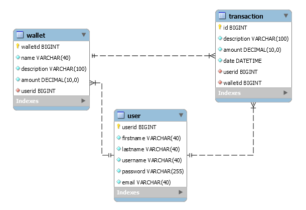

Resource Manager - Spring MVC Web Application
======================================

Application Description
-----------------------


A user is defined by the following attributes:

* _First name_ - user's first name
* _Last name_ - user's last name
* _Username_ - unique user's name
* _Email_ - user's email
* _Password_ - user's password

A wallet is defined by the following attributes:

* _Name_ - a short wallet name
* _Description_ - a full description of the wallet
* _Amount_ - the currency that is available
* _UserID_ - the owner of the wallet

A transaction is defined by the following attributes:

* _Description_ - a full description of the transaction
* _Amount_ - the currency that has been transfered
* _Date_ - the date on which the transaction was made


The application will provide the following operations:
------------------------------------------------------
Users management: 
* [Create](/blob/main/src/main/webapp/WEB-INF/jsp/jspImages/register.png) 
* Read
* Update
* Delete

Wallet management:
* Create
* Read
* Update
* Delete
* Transfer - _not implemented_

Transaction management - _not implemented_

Authentication method - _not implemented_

Technologies
------------
* Spring 5
* Spring MVC
* JPA
* Bootstrap
* JSP
* JSTL
* JDK 15
* MySQL
* IntelliJ IDEA
* Maven
* Tomcat

Application Setup
-----------------
In order to run this application you must create a MySQL database called `accountbanking`:

```sql
CREATE DATABASE accountbanking;
USE accountbanking;
CREATE TABLE `user` (
  `userid` bigint NOT NULL AUTO_INCREMENT PRIMARY KEY,
  `firstname` varchar(40) NOT NULL,
  `lastname` varchar(40) NOT NULL,
  `username` varchar(40) NOT NULL,
  `password` varchar(255) NOT NULL,
  `email` varchar(40) NOT NULL
);
CREATE TABLE `wallet` (
  `walletid` bigint NOT NULL AUTO_INCREMENT PRIMARY KEY,
  `name` varchar(40) NOT NULL,
  `description` varchar(100) NOT NULL,
  `amount` decimal NOT NULL,
  `userid` bigint NOT NULL
);
CREATE TABLE `transaction` (
  `id` bigint NOT NULL AUTO_INCREMENT PRIMARY KEY,
  `description` varchar(100) NOT NULL,
  `amount` decimal NOT NULL,
  `date` datetime NOT NULL,
  `userid` bigint NOT NULL,
  `walletid` bigint NOT NULL
);
ALTER TABLE wallet
ADD FOREIGN KEY (userid) REFERENCES user(userid);
ALTER TABLE transaction
ADD FOREIGN KEY (userid) REFERENCES user(userid);
ALTER TABLE transaction
ADD FOREIGN KEY (walletid) REFERENCES wallet(walletid);
```

The following image shows the database schema used in this application:



The database connection details can be changed from file src/main/resources/application.properties:
```properties
spring.datasource.username=Eduard
spring.datasource.password=
```
In order to run application using Maven you must create a tomcat server using Spring Tool Suit and launch the main class BankApplication.java.
Next you can access the following link using any browser: [http://localhost:8080/](http://localhost:8080/)
